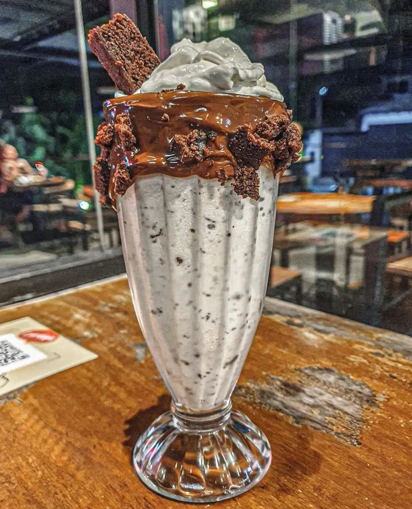

# ☕ The Coffee Shop

A beautiful, responsive single-page coffee shop website featuring smooth scrolling, animations, and an elegant design. Built with HTML5, CSS3, JavaScript, and Bootstrap, this project showcases a modern café experience with menu displays, ordering capabilities, and mobile app integration.


## 🌟 Features

- **Smooth Scrolling Navigation**: Single-page design with smooth scroll to sections
- **Responsive Design**: Fully responsive layout that works on all devices\
- **Product Gallery**: Grid-based menu display with hover effects
- **Order System**: Click-to-order buttons with pricing in INR (₹)
- **Contact Form**: Built-in contact form for customer inquiries
- **Social Media Integration**: Links to Facebook, Instagram, Twitter, Pinterest, YouTube
- **Scroll-to-Top Button**: Easy navigation back to top
- **Pre-loader Animation**: Professional loading screen

## 🛠️ Technologies Used

- **HTML5**: Semantic markup and structure
- **CSS3**: Custom styling with animations and transitions
- **JavaScript/jQuery**: Interactive functionality
- **Bootstrap 3.x**: Responsive grid system and components
- **Font Awesome**: Icon library
- **Google Fonts**: 
  - Pacifico (headings)
  - Roboto (body text)

### JavaScript Libraries & Plugins:
- **jQuery 1.11.2**
- **WOW.js**: Scroll animations
- **Owl Carousel**: Image carousel
- **Masonry**: Grid layout
- **LocalScroll & ScrollTo**: Smooth scrolling
- **Counter-Up**: Animated counters
- **Modernizr**: Feature detection

## 📁 Project Structure

```
The-coffee-shop/
├── index.html              # Main HTML file
├── cd.html                 # Order/checkout page
├── assets/
│   ├── css/
│   │   ├── bootstrap.min.css
│   │   ├── font-awesome.min.css
│   │   ├── style.css           # Main stylesheet
│   │   ├── responsive.css      # Responsive styles
│   │   ├── animate.css         # Animation styles
│   │   └── plugins.css         # Plugin styles
│   ├── js/
│   │   ├── vendor/
│   │   │   ├── jquery-1.11.2.min.js
│   │   │   ├── bootstrap.min.js
│   │   │   └── modernizr-2.8.3-respond-1.4.2.min.js
│   │   ├── plugins.js          # All plugin code
│   │   └── main.js             # Main JavaScript
│   ├── images/                 # All image assets
│   └── menu/                   # Menu item images (1.jpg - 12.jpg)
└── README.md
```

## 🚀 Getting Started

### Prerequisites

- A modern web browser (Chrome, Firefox, Safari, Edge)
- No server setup required - can run directly from file system
- (Optional) Local server for better performance

### Installation

1. **Clone the repository**:
```bash
git clone https://github.com/Viidhyanshu/The-coffee-shop.git
```

2. **Navigate to the project directory**:
```bash
cd The-coffee-shop
```

3. **Open in browser**:
   - Simply double-click `index.html`, or
   - Use a local server:

```bash
# Using Python 3
python -m http.server 8000

# Using Python 2
python -m SimpleHTTPServer 8000

# Using Node.js http-server
npx http-server
```

4. **Access the website**:
   - Direct file: `file:///path/to/index.html`
   - Local server: `http://localhost:8000`

## 💻 Usage

### Navigation
- Click navigation links to smoothly scroll to different sections
- Fixed navigation menu appears on scroll
- Mobile-friendly hamburger menu on small screens

### Sections Overview

1. **Home** (`#slider`): Hero section with tagline and CTA
2. **About** (`#abouts`): Story of brewedbypanda café
3. **New Feature** (`#features`): Special coffee highlights
4. **Order Now** (`#portfolio`): Product gallery with 12 items
5. **Menu** (`#ourPakeg`): Categorized menu with pricing
6. **Contact** (`#footer_widget`): Location, hours, and contact form

### Ordering
- Click "Order" button on any menu item
- Redirects to `cd.html` for checkout (customize this page as needed)

### Customization

**Colors**: Edit in `assets/css/style.css`
```css
/* Primary color: #e7a331 (gold) */
/* Secondary color: #d6962c (darker gold) */
/* Background: #1E2E3B (dark blue) */
```

**Menu Items**: Update in `index.html`
```html
<div class="col-md-3 single_portfolio_text">
    
    <div class="portfolio_images_overlay">
        <h6>Item Name</h6>
        <a href="cd.html">
            <input type="button" value="Order">
            <p class="product_price">₹Price</p>
        </a>
    </div>
</div>
```


## 🎨 Design Features

- **Background Images**: High-quality café and coffee images
- **Color Scheme**: Warm gold (#e7a331) with dark backgrounds
- **Typography**: Elegant Pacifico for headings, clean Roboto for body
- **Animations**: Smooth fade-in, slide, and zoom effects
- **Hover Effects**: Interactive overlay on menu items
- **Gradient Buttons**: Eye-catching order buttons with gradient

## 📝 Future Enhancements

- [ ] Complete checkout page (`cd.html`)
- [ ] Add shopping cart functionality
- [ ] Integrate payment gateway
- [ ] Add customer reviews section
- [ ] Create admin panel for menu management
- [ ] Implement online reservation system
- [ ] Add real-time order tracking

## 📄 License

This project is open source and available under the [MIT License](LICENSE).

## 👤 Author

**Vidhyanshu**

- GitHub: [@Viidhyanshu](https://github.com/Viidhyanshu)

## 🙏 Acknowledgments

- Bootstrap team for the excellent framework
- Font Awesome for icons
- Google Fonts for typography
- All open-source plugin authors

## 💡 Note

This is a frontend demonstration project. For production use:
- Implement proper backend for order processing
- Add database for menu and order management
- Secure contact form with CAPTCHA
- Optimize images for web performance
- Add SSL certificate for secure transactions

---

⭐ **Star this repository if you find it helpful!**

☕ **Made with love for coffee enthusiasts**
